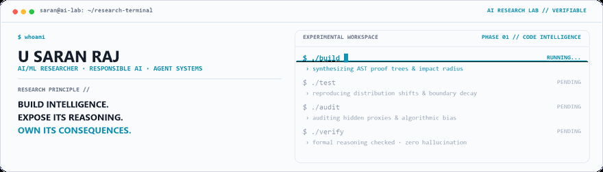

<picture>
  <source media="(prefers-color-scheme: dark)" srcset="./assets/hero-dark.gif">
  <source media="(prefers-color-scheme: light)" srcset="./assets/hero-light.gif">
  
</picture>

 

[Portfolio](https://saranraj-portfolio-two.vercel.app/) · [GitHub Repositories](https://github.com/saranraj1?tab=repositories) · [LinkedIn](https://www.linkedin.com/in/saranraj-u-663615352/) · [Email](mailto:saran17102005@gmail.com)

---

### 🔬 Research Domains

| Domain | Focus |
|---|---|
| **Code Intelligence** | AST analysis · impact analysis · program repair · provenance |
| **Responsible AI** | Fairness auditing · proxy leakage · bias detection · transparency |
| **Agent Systems** | Multi-agent reasoning · autonomous workflows · verification gates |
| **AI Reliability & XAI** | Failure analysis · robustness · SHAP / counterfactuals · interpretable evidence |

---

### 🛰️ Flagship Systems

| System | What It Investigates | Stack / Mechanism |
|---|---|---|
| **[TITAN](https://github.com/saranraj1/Titan)** | Change-aware code intelligence & impact reasoning | AST · Git co-change history · Datalog · proof trees |
| **[DARA v2](https://github.com/saranraj1/DARA-v2)** | Autonomous root-cause analysis & software repair | Multi-agent workflows · vector search · Docker · Neo4j |
| **[SilentBias](https://github.com/saranraj1/SilentBias)** | Hidden proxy leakage & algorithmic fairness auditing | Shadow models · proxy analysis · fairness metrics |
| **[Agent-Noir](https://github.com/saranraj1/AGENT-NOIR)** | Deception, consensus & multi-agent reliability | Deterministic simulation · provenance · independent audit |

---

### 🧪 Failure Lab

> *Where does an AI system stop being trustworthy — and can we prove where it happened?*

<picture>
  <source media="(prefers-color-scheme: dark)" srcset="./assets/pipeline-dark.gif">
  <source media="(prefers-color-scheme: light)" srcset="./assets/pipeline-light.gif">
  
</picture>

Selected experiments: **[XAI Lab](https://github.com/saranraj1/XAI-Lab)** · [Data Decay](https://github.com/saranraj1/data_decay) · [OOD Explorer](https://github.com/saranraj1/OOD-explorer) · [MissingnessMatter](https://github.com/saranraj1/MissingnessMatter) · [Fragility Index](https://github.com/saranraj1/Fragility_index)

---

### ⚙️ Tech Stack

- **Languages:** Python, TypeScript, JavaScript, SQL
- **AI / ML & Agents:** PyTorch, TensorFlow, scikit-learn, Transformers, LLaMA, RAG, Multi-Agent Systems
- **Data & Systems:** Neo4j, PostgreSQL, Redis, FAISS, Docker, FastAPI, GitHub Actions

---

### 📊 GitHub Activity

<picture>
  <source media="(prefers-color-scheme: dark)" srcset="./assets/activity-dark.svg">
  <source media="(prefers-color-scheme: light)" srcset="./assets/activity-light.svg">
  
</picture>
