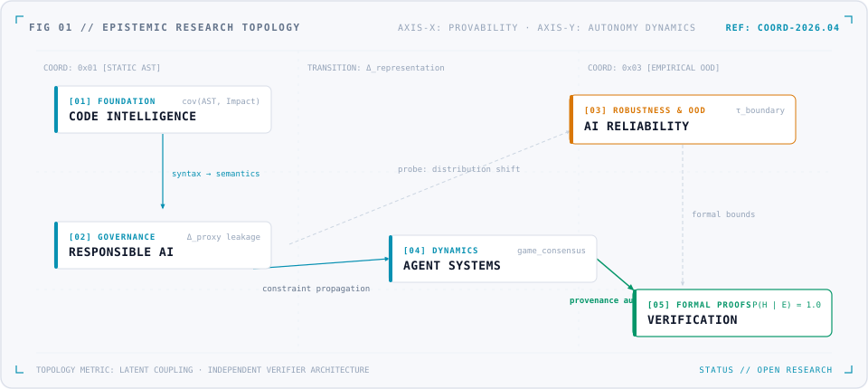
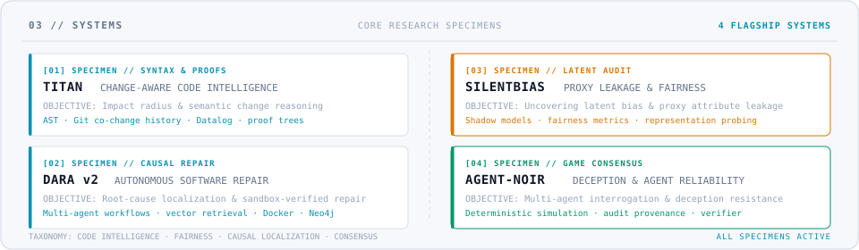

### 01 / IDENTITY

<picture>
  <source media="(prefers-color-scheme: dark)" srcset="./assets/hero-dark.gif">
  <source media="(prefers-color-scheme: light)" srcset="./assets/hero-light.gif">
  
</picture>

<p align="center">
  <i>"I investigate where intelligent systems fail — and build tools to expose why."</i>
</p>

<p align="center">
  <a href="https://saranraj-portfolio-two.vercel.app/">Portfolio</a> ·
  <a href="https://github.com/saranraj1?tab=repositories">GitHub Repositories</a> ·
  <a href="https://www.linkedin.com/in/saranraj-u-663615352/">LinkedIn</a> ·
  <a href="mailto:saran17102005@gmail.com">Email</a>
</p>

---

### 02 / RESEARCH MAP

<picture>
  <source media="(prefers-color-scheme: dark)" srcset="./assets/map-dark.svg">
  <source media="(prefers-color-scheme: light)" srcset="./assets/map-light.svg">
  
</picture>

---

### 03 / SYSTEMS

<picture>
  <source media="(prefers-color-scheme: dark)" srcset="./assets/systems-dark.svg">
  <source media="(prefers-color-scheme: light)" srcset="./assets/systems-light.svg">
  
</picture>

<p align="center">
  <a href="https://github.com/saranraj1/Titan"><b>[01] TITAN</b></a> ·
  <a href="https://github.com/saranraj1/DARA-v2"><b>[02] DARA v2</b></a> ·
  <a href="https://github.com/saranraj1/SilentBias"><b>[03] SILENTBIAS</b></a> ·
  <a href="https://github.com/saranraj1/AGENT-NOIR"><b>[04] AGENT-NOIR</b></a>
</p>

---

### 04 / FAILURE LAB

<picture>
  <source media="(prefers-color-scheme: dark)" srcset="./assets/pipeline-dark.gif">
  <source media="(prefers-color-scheme: light)" srcset="./assets/pipeline-light.gif">
  
</picture>

<p align="center">
  <a href="https://github.com/saranraj1/data_decay">Data Decay</a> ·
  <a href="https://github.com/saranraj1/OOD-explorer">OOD Explorer</a> ·
  <a href="https://github.com/saranraj1/MissingnessMatter">MissingnessMatter</a> ·
  <a href="https://github.com/saranraj1/Fragility_index">Fragility Index</a> ·
  <a href="https://github.com/saranraj1/XAI-Lab">XAI Lab</a>
</p>

---

### 05 / RESEARCH NOTE

> **`RESEARCH NOTE // 001`**  
>  
> *"I am interested in the gap between what an AI system predicts and what we can actually prove about it."*

---

### 06 / TOOLS

`RUNTIME` Python · TypeScript · FastAPI · PyTorch/TensorFlow · RAG · FAISS  
`INFRA` PostgreSQL · Redis · Neo4j · Docker · GitHub Actions

---

```
SARAN@RESEARCH-LAB
────────────────────────────────────────────────────────────
BUILD → INTERROGATE → VERIFY → REPEAT
```
