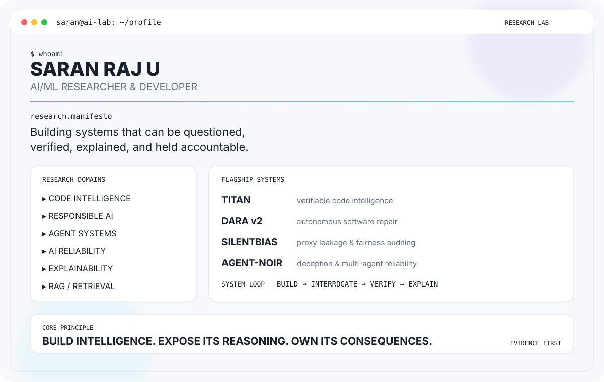

<div align="center">

<picture>
  <source media="(prefers-color-scheme: dark)" srcset="./assets/hero-dark.svg">
  <source media="(prefers-color-scheme: light)" srcset="./assets/hero-light.svg">
  
</picture>

<br>

### BUILD INTELLIGENCE. EXPOSE ITS REASONING. OWN ITS CONSEQUENCES.

AI/ML researcher and developer working across **code intelligence, responsible AI, agent systems, explainability, reliability, and retrieval**.

<p>
  <a href="https://saranraj-portfolio-two.vercel.app/">Portfolio</a> ·
  <a href="https://github.com/saranraj1?tab=repositories">Repositories</a> ·
  <a href="https://github.com/saranraj1/Titan">TITAN</a> ·
  <a href="https://github.com/saranraj1/AGENT-NOIR">Agent-Noir</a>
</p>

</div>

---

## 🔬 Research Identity

<table>
<tr>
<td width="33%" align="center"><b>CODE INTELLIGENCE</b><br>AST analysis · impact analysis · program repair · provenance</td>
<td width="33%" align="center"><b>RESPONSIBLE AI</b><br>fairness · proxy leakage · bias auditing · transparency</td>
<td width="33%" align="center"><b>AGENT SYSTEMS</b><br>multi-agent reasoning · autonomous workflows · verification</td>
</tr>
<tr>
<td align="center"><b>AI RELIABILITY</b><br>robustness · failure analysis · evaluation · safety</td>
<td align="center"><b>EXPLAINABLE AI</b><br>SHAP · LIME · counterfactuals · interpretable evidence</td>
<td align="center"><b>RAG / RETRIEVAL</b><br>grounding · vector search · retrieval failure modes</td>
</tr>
</table>

---

# 🛰️ Flagship Systems

| System | What it investigates | Stack / mechanism |
|---|---|---|
| **[TITAN](https://github.com/saranraj1/Titan)** | Change-aware code intelligence and impact reasoning | AST · Git co-change history · Datalog · proof trees |
| **[DARA v2](https://github.com/saranraj1/DARA-v2)** | Autonomous root-cause analysis and software repair | LLM agents · vector search · Docker · Neo4j |
| **[SilentBias](https://github.com/saranraj1/SilentBias)** | Hidden proxy leakage and fairness failures | Shadow model · proxy analysis · fairness metrics |
| **[Agent-Noir](https://github.com/saranraj1/AGENT-NOIR)** | Deception, consensus and multi-agent reliability | Deterministic simulation · provenance · independent audit |

### TITAN — the verification-first one

`AST` → `Git co-change history` → `Datalog reasoning` → `Impact / Risk / Validation` → `Proof`

- Offline-first and designed for deterministic reasoning.
- Supports Python, JavaScript, TypeScript and TSX analysis.
- Produces proof trees and change-impact evidence rather than only a recommendation.
- Integrates with VS Code, GitHub Actions, CI runners and agent workflows.
- The repository currently reports **291 passing tests** in its 1.0.0 README.

### DARA v2 — the autonomous repair pipeline

`Ingest` → `Diagnose` → `Patch` → `Sandbox` → `Security Review` → `PR`

- Multi-agent debugging and repair workflow.
- Vector-search context and Neo4j-based architectural/blast-radius reasoning.
- Docker-isolated validation with security-oriented checks.
- Observability through Prometheus, Grafana and Jaeger.

### SilentBias — the fairness audit

`Protected attribute hidden` → `Shadow Model` → `Leakage Detection` → `Proxy Analysis`

- Tests whether supposedly “blind” models can reconstruct protected information.
- Includes proxy-feature discovery, Disparate Impact and Statistical Parity analysis.

### Agent-Noir — the reliability experiment

`Imperfect agents` + `manufactured consensus` → `belief propagation` → `verdict` → `audit`

- Deterministic, offline simulation with an independent audit script.
- Separates **agreement** from **truth** as an experimental question.
- Runs controlled deception-on / deception-off experiments across fixed seeds.

---

# 🧪 The Failure Lab

I build experiments around one question:

> **Where does an AI system stop being trustworthy — and can we prove where it happened?**

```text
DATA DECAY
    ↓
DISTRIBUTION SHIFT
    ↓
OUT-OF-DISTRIBUTION FAILURE
    ↓
MISSINGNESS
    ↓
PROXY LEAKAGE
    ↓
MODEL FRAGILITY
    ↓
HUMAN ↔ MODEL DISAGREEMENT
    ↓
AUDIT → EXPLAIN → VERIFY
```

Selected research systems: **[XAI Lab](https://github.com/saranraj1/XAI-Lab)** · [Data Decay](https://github.com/saranraj1/data_decay) · [OOD Explorer](https://github.com/saranraj1/OOD-explorer) · [MissingnessMatter](https://github.com/saranraj1/MissingnessMatter) · [Fragility Index](https://github.com/saranraj1/Fragility_index) · [Cold-start Audit](https://github.com/saranraj1/Cold-start-audit) · [Human-vs-Model](https://github.com/saranraj1/human-vs-model).

---

# 🧠 Applied AI Systems

| System | Focus |
|---|---|
| **[Thenali AI](https://github.com/saranraj1/Thenali-AI)** | Developer learning + repository intelligence |
| **[Dual-LLM AI Agent](https://github.com/saranraj1/Dual-LLM-AI-Agent)** | Local-first autonomous coding assistant |
| **[XAI Lab](https://github.com/saranraj1/XAI-Lab)** | Explainability, drift, fairness and counterfactual analysis |
| **[Voice Guardian](https://github.com/saranraj1/voice-guardian)** | Real-time voice emotion recognition |
| **[SignBridge](https://github.com/saranraj1/SignBridge)** | On-device gesture/sign understanding |
| **[PocketMind AI](https://github.com/saranraj1/PocketMind-AI)** | Personal/local AI experimentation |

---

# 📐 Research Footprint

A snapshot of the work represented on my portfolio — not live GitHub counters:

`120+` AI challenge days · `10` research reports · `9` failure modes reproduced · `4` AI projects · `2` internships · `1` research initiative

The common thread is not “AI that works once.” It is **AI that can be inspected when it fails**.

---

# ⚙️ Technology Matrix

**Languages**

`Python` `JavaScript` `TypeScript` `SQL`

**AI / ML**

`TensorFlow` `Keras` `scikit-learn` `XGBoost` `librosa` `Transformers`

**LLM / Agents**

`LLaMA` `Qwen` `AWS Bedrock` `Whisper` `RAG` `Multi-Agent Systems`

**Data / Retrieval**

`FAISS` `DynamoDB` `S3` `PostgreSQL` `Redis` `Neo4j`

**Engineering**

`FastAPI` `Docker` `GitHub Actions` `REST APIs` `VS Code Extensions`

**Research**

`XAI` `Fairness` `Robustness` `Evaluation` `Verification` `Failure Analysis`

---

# 📊 GitHub Activity

<picture>
  <source media="(prefers-color-scheme: dark)" srcset="./assets/activity-dark.svg">
  <source media="(prefers-color-scheme: light)" srcset="./assets/activity-light.svg">
  
</picture>

> Updated automatically by GitHub Actions. The graphic is generated from GitHub's contribution calendar; it does not require a third-party stats service.

---

# 🧭 Research Principles

```text
01  BUILD
    Create systems that solve meaningful problems.

02  INTERROGATE
    Question their assumptions and behavior.

03  VERIFY
    Test claims against evidence.

04  EXPLAIN
    Make decisions understandable.

05  ACCOUNT
    Treat consequences as part of the system.
```

### My principle

> **Build intelligence. Expose its reasoning. Own its consequences.**

---

<div align="center">

**[GitHub](https://github.com/saranraj1) · [Portfolio](https://saranraj-portfolio-two.vercel.app/)**

```text
SARAN@AI-LAB:~$ ./next_experiment

Initializing hypothesis...
Loading baseline...
Stress-testing assumptions...
Auditing evidence...

> experiment continues_
```

</div>
